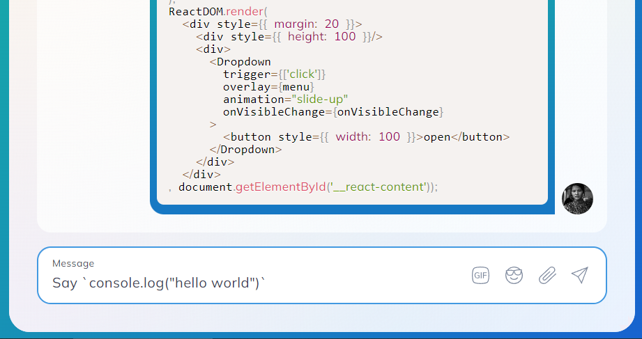

[](https://badge.fury.io/js/backticks-codeblocks)
[](https://www.npmjs.com/package/backticks-codeblocks)
[](http://hits.dwyl.com/multipliedtwice/backticks-codeblocks)
[](https://codecov.io/gh/multipliedtwice/backticks-codeblocks)
[](LICENSE)

# Backticks-Codeblocks, syntax highlighting parser for fenced code

Backticks Codeblocks is a **code fence** library for parsing text and generating structures that can be rendered as code blocks or inline code using PrismJS. It supports integration with modern JavaScript frameworks such as React, Angular, Vue, and Svelte.

## Features

- Generates PrismJS-compatible structures
- Supports multiple JavaScript frameworks (React, Angular, Vue, Svelte)
- Easy integration (works as a pure function)
- Customizable (ignore edge cases by regex)



Package provides a simple and efficient way to parse strings containing backticks. It differentiates between inline code, marked by single backticks, and code blocks, surrounded by triple backticks, and returns them as structured data. It's particularly useful for processing markdown text or any text that follows a similar convention for denoting code segments.

## Installation

To install the package, use the following command:

```bash
npm install backticks-codeblocks
```

or if you use yarn

```bash
yarn add backticks-codeblocks
```

## Usage

Import the `processText` function from the package and use it to parse a string with backticks:

````javascript
import { processText } from 'backticks-codeblocks';

const result = processText('Some `inline code` and ```block code```');
console.log(result);
````

## Ignore patterns

In some cases you can prevent backticks to be parsed as a block of code using second parameter.

````ts
const ignorePatterns: [RegExp, string][] = [
  [
    new RegExp('"```\\n"'.replace(/[.*+?^${}()|[\]\\]/g, '\\$&'), 'g'),
    'unique_string_as_a_name_identifier',
  ],
];
processText('Some `inline code` and ```block code```', ignorePatterns);
````

## Input/Output Examples

The following table shows some example inputs and the corresponding output from the `processText` function:

### Convert Block Code to Preformatted Text

- Input:

  \`\`\`requiredDependency.mockImplementationOnce(() => {\
   throw new Error('Test error');\
  });\`\`\`

- Output:

  ```js
  [{
    code: "requiredDependency.mockImplementationOnce(() => {
      throw new Error('Test error');
    });",
    isBlock: true
  }]
  ```

### Convert Inline and Block Code Correctly

- Input:

  Look at \`this\` code:
  \`\`\`requiredDependency.mockImplementationOnce(() => {
  throw new Error('Test error');
  });\`\`\`

- Output:

  ```js
  [
    'Look at ',
    { code: 'this', isBlock: false },
    ' code:\n    ',
    {
      code: `requiredDependency.mockImplementationOnce(() => {
        throw new Error('Test error');
      });`,
      isBlock: true,
    },
  ];
  ```

### Handles Consecutive Code Blocks

- Input:

  Check these snippets: \`\`\`code1\`\`\` then \`\`\`code2\`\`\`

- Output:

  ```js
  [
    'Check these snippets: ',
    { code: 'code1', isBlock: true },
    ' then ',
    { code: 'code2', isBlock: true },
  ];
  ```

### Handles Nested Backticks

- Input:

  Here is an example \`code with \`nested\` backticks\` end

- Output:

  ```js
  [
    'Here is an example ',
    {
      code: 'code with ',
      isBlock: false,
    },
    'nested',
    {
      code: ' backticks',
      isBlock: false,
    },
    ' end',
  ];
  ```

### Handles Interrupted Code Blocks

- Input:

  Start ```incomplete code block

- Output:
  ````js
  ['Start ```incomplete code block'];
  ````

### Handles Mixed Backticks

- Input:

  Inline \`code\` and \`\`\`block code``` mixed

- Output:

  ```js
  [
    'Inline ',
    { code: 'code', isBlock: false },
    ' and ',
    { code: 'block code', isBlock: true },
    ' mixed',
  ];
  ```

### Handles Escaped Backticks

- Input:

  This is not \`code but \\\`escaped backticks\\\``

- Output:

  ```js
  [
    'This is not ',
    { code: 'code but \`escaped backticks\`', isBlock: false }
  ]`
  ```

### Handles Code Block at the Start

- Input:

  \`\`\`code at start``` followed by text

- Output:

  ```js
  [{ code: 'code at start', isBlock: true }, ' followed by text'];
  ```

### Handles Code Block at the End

- Input:

  Text followed by `code at end`

- Output:

  ```js
  ['Text followed by ', { code: 'code at end', isBlock: true }];
  ```

### Handles Empty Code Blocks

- Input:

  Empty code blocks \`\`\` \`\`\` are weird

- Output:

  ```js
  ['Empty code blocks are weird'];
  ```

### Handles Adjacent Code Blocks

- Input:

  No space between \`\`\`code1\`\`\`\`\`\`code2``` blocks

- Output:

  ```js
  [
    'No space between',
    { code: 'code1', isBlock: true },
    { code: 'code2', isBlock: true },
    'blocks',
  ];
  ```

### Handles Unmatched Backticks Inside Code Blocks

- Input:
  ``code with ` inside``

- Output:
  ```js
  [{ code: 'code with ` inside', isBlock: true }];
  ```

### Handles Code Blocks With New Lines

- Input:
  `Multi-line ```\ncode block\n````

- Output:
  ```js
  ['Multi-line ', { code: '\ncode block\n', isBlock: true }];
  ```

## Performance

The `processText` function works fairly fast and is capable of handling large texts within reasonable time frames.

## License

This project is open-sourced software licensed under the MIT license.

#### Credits:
- Super Kick Gym - [Brazilian Jiu Jitsu in Bangkok](https://en.bjj-bangkok.com)

- Rememo - [Free Task Management and Corporate Chat](https://rememo.io)
